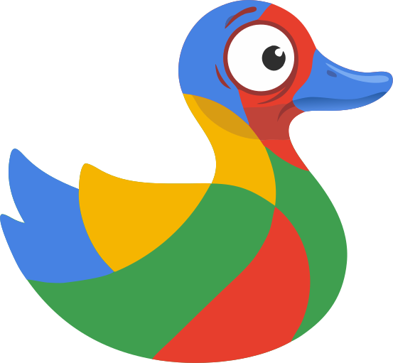

# unduck



A browser extension for Chrome and Firefox that adds a **"Search Google"** button next to the DuckDuckGo search bar. One click sends your current query to Google in the same tab — no copy-pasting, no new tabs.

- [Chrome Web Store](#) *(link once published)*
- [Firefox Add-ons (AMO)](#) *(link once published)*

## Features

- **Tab context aware** — Images → Google Images, Videos → Google Videos, News → Google News, Web → plain Google search
- **SPA-safe** — button survives DuckDuckGo's React navigation as you refine queries and browse results
- **Dark mode** — adapts to DDG's light and dark themes automatically
- **Keyboard accessible** — Tab to focus, Enter or Space to activate
- **No permissions** — reads only the current tab's URL (`window.location`), nothing else

## Development

```bash
# Install dev tooling
npm install

# Firefox — live reload
npm start

# Lint
npm run lint

# Unit tests (no browser needed)
npm test

# Package for submission
npm run build:chrome    # → unduck-chrome.zip
npm run build:firefox   # → web-ext-artifacts/unduck-0.1.0.zip
```

**Load unpacked in Chrome:**
1. Open `chrome://extensions`
2. Enable Developer mode
3. Load unpacked → select this directory

## How it works

`content.js` runs on every `duckduckgo.com` page that has a `?q=` parameter. It injects a `<button id="unduck-btn">` into the DDG header using `#react-ai-button-slot` (with `.header--aside` as fallback). A `MutationObserver` on `document.body` re-injects the button after each React re-render. The click handler reads `window.location.search` at click time and maps the DDG `ia` parameter to a Google `tbm` value.

| DDG tab | `ia` param | Google URL |
|---------|-----------|------------|
| Web | *(none)* | `google.com/search?q=…` |
| Images | `images` | `google.com/search?q=…&tbm=isch` |
| Videos | `videos` | `google.com/search?q=…&tbm=vid` |
| News | `news` | `google.com/search?q=…&tbm=nws` |

## Privacy

See [PRIVACY.md](PRIVACY.md)

## License

GPL v3 — see [LICENSE](LICENSE)
